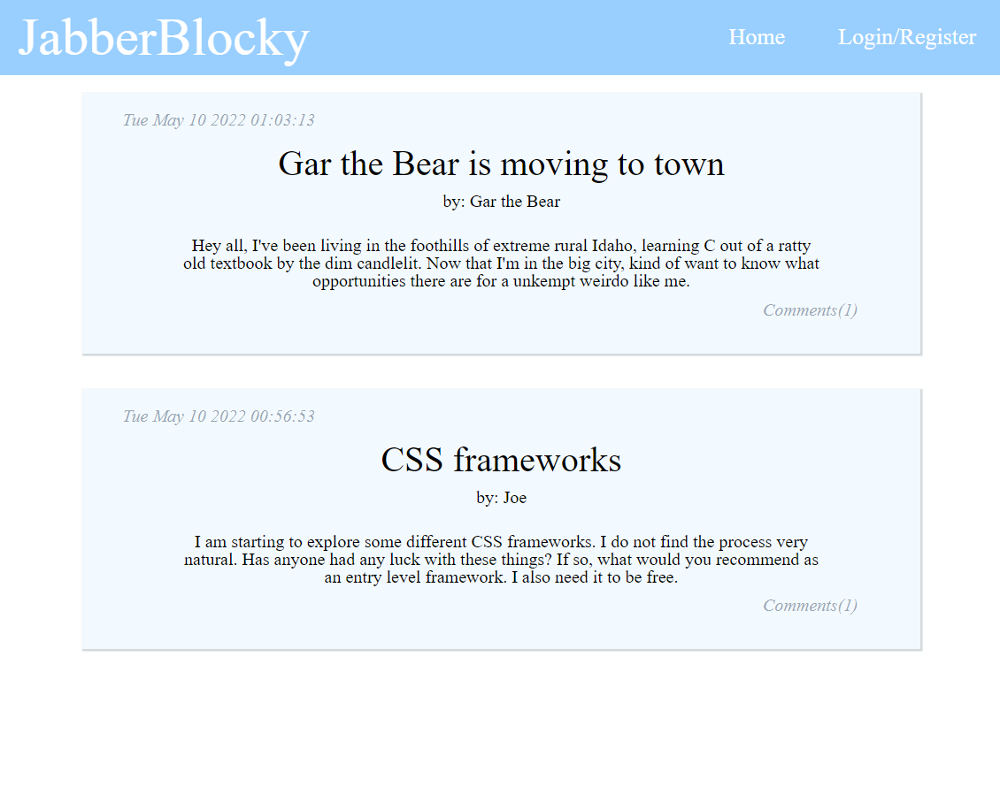
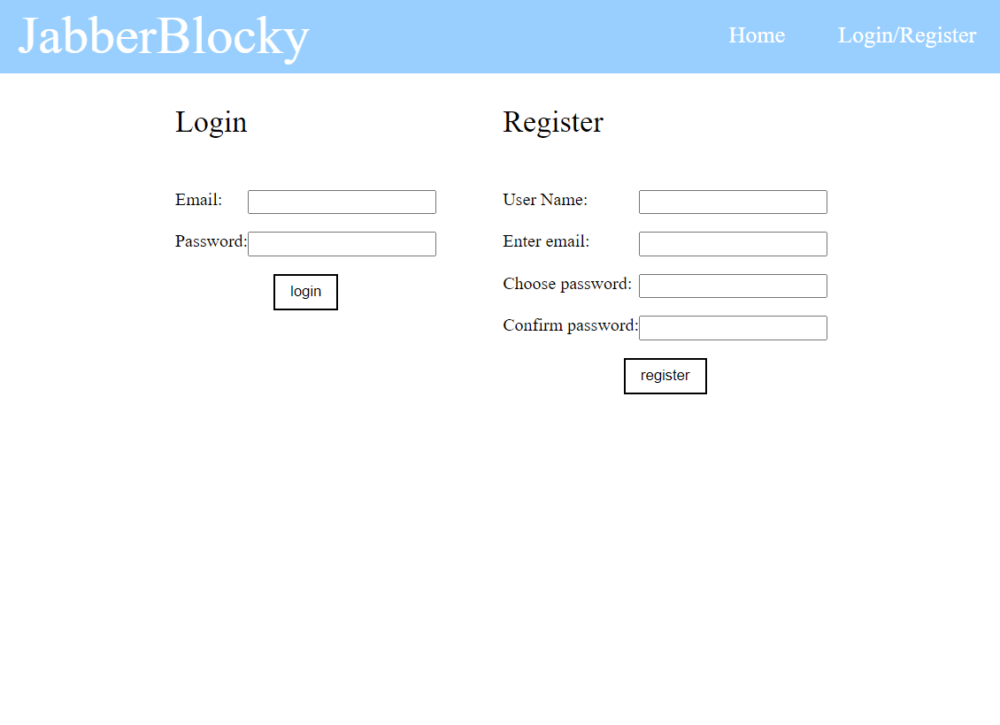
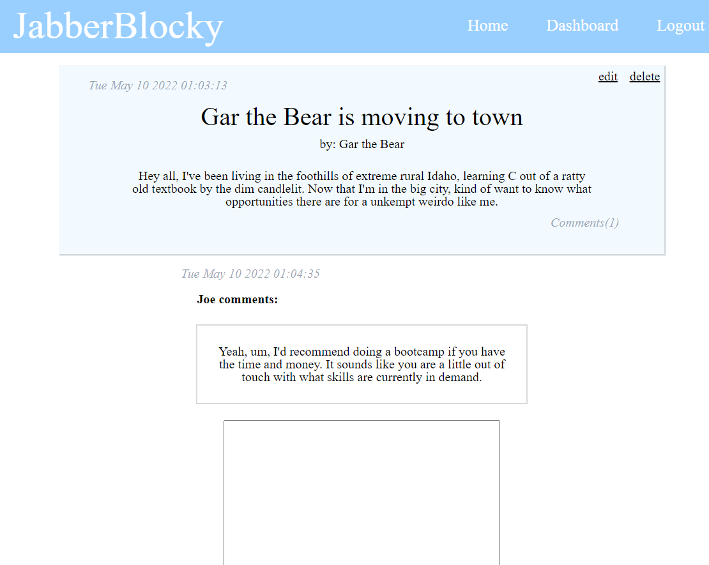

# JabberBlocky
  

  
## Description

It is a multi-user tech blog for developers to make posts and comment on each other's posts.

## Table of Contents

- [Installation](#installation)
- [Usage](#usage)
- [Credits](#credits)
- [Features](#features)
- [Contribute](#contribute)
- [Tests](#tests)
- [Questions](#questions)
- [License](#license)

## Installation

1. Clone Repo, 2. run npm i, 3. run npm start

## Usage

People can make posts about emerging technologies. People can respond to open ended questions posed in posts. 

## Credits

Collaborators
- N/A

Third Party Assets
- bcrypt, sequelize, express, dotenv, mysql2

Tutorials
- N/A

## Features

- Add post, edit post, delete post, make comments.

## How to Contribute

N/A
  
## Tests

N/A

## Questions

Any questions? Contact me at:
- E-mail: joechristiansonwebdev@gmail.com
- GitHub: https://github.com/JoeChristianson
- Other means: N/A

## License

This app is covered by the MIT license. For more information, visit https://opensource.org/licenses/Apache-2.0.

## Live Link

https://jabberblocky.herokuapp.com/